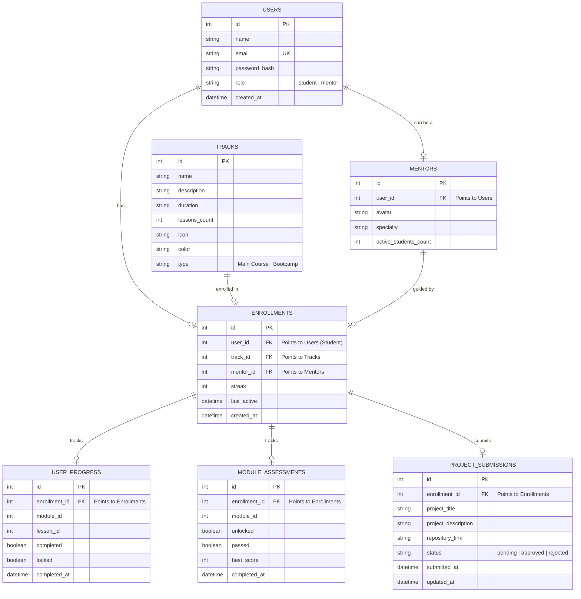

# Backend Implementation Guide for EduFlick AI

This document provides a detailed overview of the backend architecture, database schema, API endpoints, and steps required to build a backend to power the **EduFlick AI** frontend.

---

## 1. Suggested Tech Stack

A standard, highly productive stack to pair with this React application:
*   **Runtime/Framework**: Node.js with **Express** (simple, standard) or **NestJS** (structured).
*   **Language**: TypeScript or JavaScript.
*   **Database**: **PostgreSQL** (relational database, ideal for structuring users, tracks, and enrollments) with **Prisma** or **Sequelize** ORM.
*   **Authentication**: JSON Web Tokens (**JWT**) stored securely or Cookie-based Sessions.
*   **Hosting**: Render, Railway, or Fly.io (for backend), Supabase or Neon (for managed Postgres database).

---

## 2. Database Schema Design (Entity-Relationship)

To replace `mockData.js`, you will need a relational schema. Below is a suggested database structure using PostgreSQL:



---

## 3. Required API Endpoints

Your backend will need to expose the following REST endpoints:

### Authentication
*   `POST /api/auth/register`
    *   Registers a new user (hashes password with `bcrypt`, saves role).
*   `POST /api/auth/login`
    *   Verifies credentials and returns a JWT token/session cookie + user details.
*   `GET /api/auth/me`
    *   Returns the current logged-in user profile details (protected by JWT verification middleware).

### Student Learning Path & Tracks
*   `GET /api/tracks`
    *   Fetches all available tracks (Main Courses & Bootcamps) from the DB.
*   `GET /api/mentors`
    *   Fetches the list of mentors.
*   `POST /api/enroll`
    *   Enrolls a user in a track with a chosen mentor. Initializes their default learning roadmap in `USER_PROGRESS` and `MODULE_ASSESSMENTS`.
*   `GET /api/enrollment/active`
    *   Retrieves the student's active enrollment details, streak, and current roadmap state.

### Lessons & Assessments
*   `POST /api/progress/lessons/:lessonId/complete`
    *   Marks a lesson as completed, updates progress, and unlocks the next sequential lesson in the DB.
*   `GET /api/assessments/:moduleId`
    *   Retrieves assessment questions for a specific module.
*   `POST /api/assessments/:moduleId/submit`
    *   Validates submitted answers on the server, calculates score, updates module completion state, and unlocks the next module if the passing score threshold is met.

### Project Submissions (Students)
*   `POST /api/submissions`
    *   Submits project details (enrollmentId, project_title, project_description, repository_link).
*   `GET /api/submissions/active`
    *   Retrieves the current student's project submissions and their status.

### Mentor Operations & Project Review
*   `GET /api/mentor/students`
    *   Fetches all students enrolled under the currently logged-in mentor, along with their progress, streaks, and last active dates.
*   `GET /api/mentor/submissions`
    *   Retrieves all pending project submissions for review.
*   `POST /api/submissions/:id/review`
    *   Allows a mentor to approve or reject a project submission with status `approved` or `rejected`.

---

## 4. Steps to Implement the Backend

Here is a step-by-step roadmap to get the backend built and integrated:

### Phase 1: Set Up Backend Skeleton
1. Create a new directory `/backend` inside the project folder.
2. Initialize it: `npm init -y` and install required dependencies:
   ```bash
   npm install express pg dotenv bcryptjs jsonwebtoken cors
   npm install -D nodemon
   ```
3. Set up entry point `server.js` with standard middleware (`express.json()`, `cors()`).

### Phase 2: Database Initialization
1. Spin up a Postgres instance (locally or on Supabase/Neon).
2. Set up the schema tables using raw SQL migrations or an ORM like **Prisma** (`npm install prisma @prisma/client`).
3. Seed the `tracks` and mentor data inside the tables using records matching `src/data/mockData.js`.

### Phase 3: Auth & Protected Routes
1. Write registration and login controllers. Hash passwords using `bcryptjs`.
2. Generate JWT tokens upon successful authentication.
3. Write an authentication middleware (`authenticateToken`) to verify requests and attach the user payload to the request object.

### Phase 4: Business Logic & Controllers
1. Implement track retrieval, mentor selection, and enrollment controllers.
2. Write the logic for updating lessons (making sure a student cannot mark a locked lesson as complete).
3. Write the assessment validation logic (grading on the server to prevent front-end client spoofing).
4. Implement the mentor analytics endpoint.

### Phase 5: Frontend Integration
1. Configure an API client on the React frontend (e.g. using `axios` or native `fetch`).
2. Replace local state manipulations inside `AuthContext.jsx`, `Dashboard.jsx`, `LessonPage.jsx`, and `AssessmentPage.jsx` with asynchronous API calls.
3. Configure CORS in the backend to allow request origins from the local Vite port (`http://localhost:5173`).
